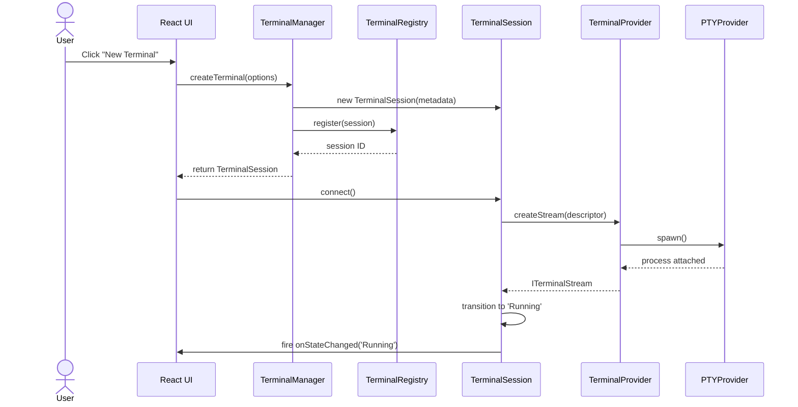
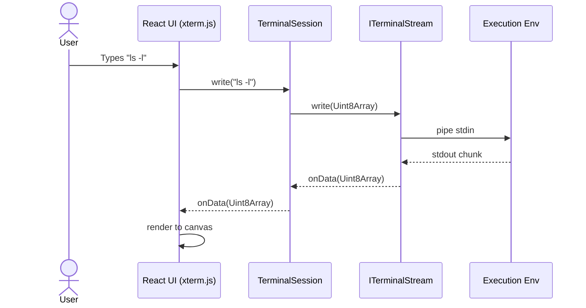
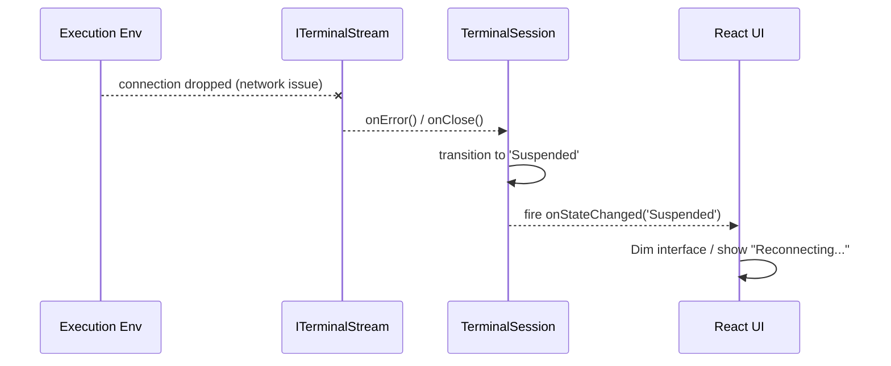
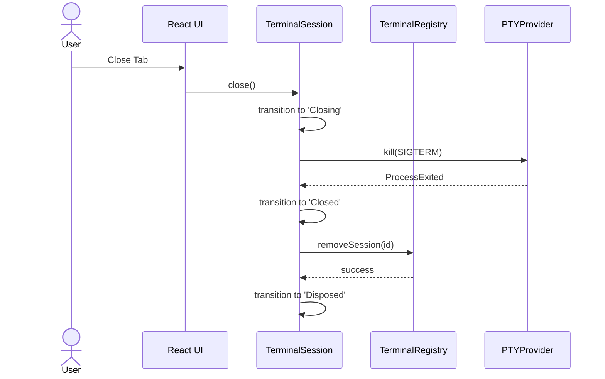

# Terminal Sequence Diagrams

## 1. Terminal Creation & Connection

```mermaid
sequenceDiagram
    actor User
    participant UI as React UI
    participant TM as TerminalManager
    participant TR as TerminalRegistry
    participant TS as TerminalSession
    participant TP as TerminalProvider
    participant PTY as PTYProvider

    User->>UI: Click "New Terminal"
    UI->>TM: createTerminal(options)
    TM->>TS: new TerminalSession(metadata)
    TM->>TR: register(session)
    TR-->>TM: session ID
    TM-->>UI: return TerminalSession
    
    UI->>TS: connect()
    TS->>TP: createStream(descriptor)
    TP->>PTY: spawn()
    PTY-->>TP: process attached
    TP-->>TS: ITerminalStream
    TS->>TS: transition to 'Running'
    TS->>UI: fire onStateChanged('Running')
```

## 2. Bidirectional Streaming

```mermaid
sequenceDiagram
    actor User
    participant UI as React UI (xterm.js)
    participant TS as TerminalSession
    participant Stream as ITerminalStream
    participant Exec as Execution Env

    User->>UI: Types "ls -l"
    UI->>TS: write("ls -l")
    TS->>Stream: write(Uint8Array)
    Stream->>Exec: pipe stdin
    
    Exec-->>Stream: stdout chunk
    Stream-->>TS: onData(Uint8Array)
    TS-->>UI: onData(Uint8Array)
    UI->>UI: render to canvas
```

## 3. Disconnection and Suspension

```mermaid
sequenceDiagram
    participant Exec as Execution Env
    participant Stream as ITerminalStream
    participant TS as TerminalSession
    participant UI as React UI

    Exec--xStream: connection dropped (network issue)
    Stream-->>TS: onError() / onClose()
    TS->>TS: transition to 'Suspended'
    TS-->>UI: fire onStateChanged('Suspended')
    UI->>UI: Dim interface / show "Reconnecting..."
```

## 4. Teardown

```mermaid
sequenceDiagram
    actor User
    participant UI as React UI
    participant TS as TerminalSession
    participant TR as TerminalRegistry
    participant PTY as PTYProvider

    User->>UI: Close Tab
    UI->>TS: close()
    TS->>TS: transition to 'Closing'
    TS->>PTY: kill(SIGTERM)
    PTY-->>TS: ProcessExited
    TS->>TS: transition to 'Closed'
    TS->>TR: removeSession(id)
    TR-->>TS: success
    TS->>TS: transition to 'Disposed'
```
